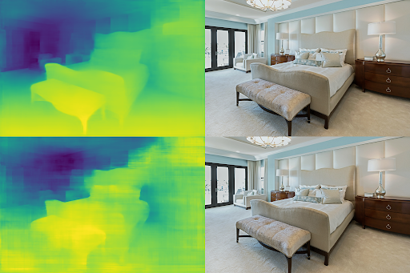

# Monocular-depth-estimation

Monocular Depth Estimation is the task of estimating the depth value (distance relative to the camera) of each pixel given a single (monocular) RGB image. This challenging task is a key prerequisite for determining scene understanding for applications such as 3D scene reconstruction, autonomous driving, and AR. State-of-the-art methods usually fall into one of two categories: designing a complex network that is powerful enough to directly regress the depth map, or splitting the input into bins or windows to reduce computational complexity. The most popular benchmarks are the KITTI and NYUv2 datasets. Models are typically evaluated using RMSE or absolute relative error.

## Model Architecture

Various Models created

| ModelName        | Backbone  | Params(Millions) | Flops(Giga) | Loss (Huber Loss)|
|------------------|:---------:|------------------| ------------|------------------|
| DV-xs            |  None     |       6.5        | 25.2        |0.00279           |
| DV-s             | Resnet-18 |       39.945     | 182.202     |0.000759          |
| DV-t             |    VIT    |       28.56      | 96.20       |0.0004003         |
| DV-x             | Resent-34 |       50.054     | 220.916     |0.0002113         |

## Inference Examples
### 1. Backbone vs No backbone

### 2. Inference

